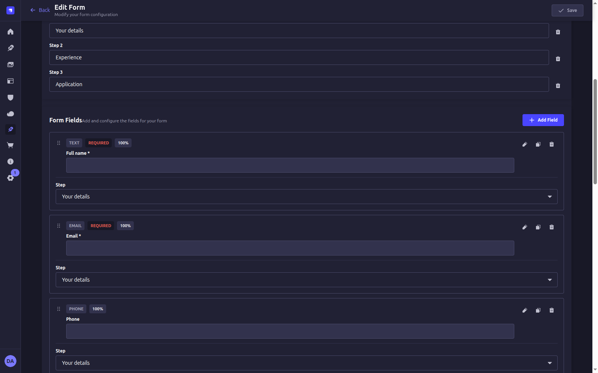

---
# ─────────────────────────────────────────────────────────────────────────
# POST TEMPLATE — copy this _TEMPLATE folder into a category to start a post:
#   src/content/blog/<category>/<your-slug>/
# The folder name becomes the URL slug: /blog/<category>/<your-slug>
# Drop a hero image in the folder (hero.png, ~1200x630 for good social cards).
# Delete the blocks below you don't need. Flip `draft` to false to publish.
# ─────────────────────────────────────────────────────────────────────────

# Required
title: 'Your post title'
description: 'One-sentence summary, 150–160 chars. Used for the meta description and social card — write it for a human and a search snippet.'
hero: './hero.png'
heroAlt: 'Describe the hero image for screen readers and SEO.'
publishedAt: '2026-01-01'

# Optional
# slug: 'custom-slug'        # defaults to the folder name
updatedAt: '2026-01-01'      # shown as "Updated"; bump on meaningful edits
draft: true                  # drafts are hidden in production builds
featured: false              # featured posts get a large card on /blog
tags: ['forms', 'strapi']

# Optional per-post SEO overrides
# seo:
#   title: 'Custom <title> if different from the post title'
#   canonical: 'https://example.com/elsewhere'   # rarely needed
#   ogImage: './social-card.png'                  # defaults to hero

# Optional richer structured data (a BlogPosting is always emitted).
# Pick ONE of the two. HowTo = step-by-step tutorial; FAQPage = Q&A.
# schema:
#   type: 'HowTo'
#   steps:
#     - name: 'Step one'
#       text: 'What the reader does in step one.'
#     - name: 'Step two'
#       text: 'What the reader does in step two.'
# schema:
#   type: 'FAQPage'
#   faq:
#     - q: 'A question readers ask?'
#       a: 'The answer.'
---

{/* LEAD — keep it self-contained; AI answer engines lift this paragraph as a
    citation, so state the answer up front. Inline formatting: **bold**,
    *italic*, `inline code`, ~~strikethrough~~, and links. */}
This opening paragraph says what the reader will learn and why it matters. You
can use **bold**, *italic*, `inline code`, an [internal link](/blog/tutorials/another-post),
and an [external link](https://strapi.io).

{/* H2 — appears in the table of contents. Use headings that match how people
    search. */}
## A section heading

Write a clear lead sentence under each heading, then the supporting detail.

{/* H3 — also appears in the table of contents. */}
### A subsection

Smaller subsection text.

{/* UNORDERED LIST */}
- First point
- Second point
- Third point

{/* ORDERED LIST */}
1. First
2. Second
3. Third

{/* TASK LIST (GitHub-flavored markdown) */}
- [x] A completed item
- [ ] An open item

{/* BLOCKQUOTE */}
> A quoted line — good for a key takeaway or a citation.

{/* CALLOUTS — types: tip, note, warning */}
<Callout type="tip">A helpful tip the reader should know.</Callout>

<Callout type="note">A neutral note or aside.</Callout>

<Callout type="warning">Something to watch out for.</Callout>

{/* CODE BLOCKS — fenced, syntax-highlighted at build time. Set the language. */}
```bash
npm install @formflowjs/strapi-plugin-formflow
```

```ts
import { createFormFlowClient } from '@formflowjs/core';

const client = createFormFlowClient({ baseUrl: 'https://cms.example.com' });
const schema = await client.getForm('contact'); // fully typed
```

{/* TABLE (GitHub-flavored markdown) */}
| Field   | Type     | Required |
| ------- | -------- | -------- |
| Name    | text     | Yes      |
| Email   | email    | Yes      |
| Message | textarea | No       |

{/* IMAGE — co-located with this file. A standalone image renders as a figure;
    its alt text becomes the caption. */}


{/* STEPS — numbered step badges for sequential instructions. */}
<Steps>
  1. Do the first thing.
  2. Then the second thing.
  3. Finish here.
</Steps>

{/* THEMATIC BREAK */}
---

## Wrap up

Close with the next step — link to a related tutorial or the relevant plugin
docs so readers (and crawlers) have somewhere to go.
